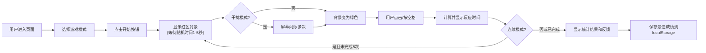

## 1. 产品概述

反应速度测试游戏，通过屏幕颜色变化触发用户响应，精准测量反应时间。提供多种训练模式和数据统计，帮助用户了解和提升反应速度。

- 主要目的：测试并训练用户的反应速度，通过娱乐化方式提供即时反馈
- 目标用户：普通大众、游戏玩家、运动员等需要测试/训练反应速度的人群
- 核心价值：精确测量、多样化训练模式、数据可视化反馈

## 2. 核心功能

### 2.1 功能模块

1. **主游戏区域**：全屏颜色变化响应区、点击/键盘交互
2. **模式选择区**：简单模式、连续模式、干扰模式切换
3. **结果展示区**：单次反应时间、统计数据、历史最佳
4. **反馈区域**：百分位排名、训练建议

### 2.2 页面详情

| 页面名称 | 模块名称 | 功能描述 |
|-----------|-------------|---------------------|
| 游戏主页面 | 模式选择 | 三种游戏模式切换，显示各模式说明 |
| 游戏主页面 | 游戏区域 | 全屏颜色变化区域，支持点击和空格键响应 |
| 游戏主页面 | 结果统计 | 显示当前测试结果、平均反应时间、最快/最慢时间 |
| 游戏主页面 | 历史记录 | 显示历史最佳成绩，存储于localStorage |
| 游戏主页面 | 训练反馈 | 模拟百分位排名，提供个性化反馈 |

## 3. 核心流程

用户进入页面 → 选择游戏模式 → 点击开始 → 等待红色背景 → 背景变绿后尽快点击/按空格 → 显示反应时间 → （连续模式自动进入下一轮）→ 显示最终统计和反馈

## 4. 用户界面设计

### 4.1 设计风格

- **主色调**：深邃黑色背景 `#0a0a0f`，霓虹红 `#ff2d55` 作为等待色，霓虹绿 `#00ff88` 作为响应色
- **辅助色**：电光蓝 `#00d4ff` 用于高亮和按钮，深紫 `#1a1a2e` 作为卡片背景
- **按钮风格**：霓虹发光效果，圆角设计，悬停时亮度增强
- **字体**：使用 Orbitron（科技感字体）作为显示字体，Inter 作为正文字体
- **布局风格**：全屏沉浸式游戏体验，中央聚焦，信息卡片浮动于边缘
- **视觉效果**：光晕、脉冲动画、渐变背景、细微噪点纹理

### 4.2 页面设计概述

| 页面名称 | 模块名称 | UI 元素 |
|-----------|-------------|-------------|
| 游戏主页面 | 游戏区域 | 全屏渐变色背景、中央大号倒计时/反应时间数字、脉冲发光效果 |
| 游戏主页面 | 模式选择 | 三个卡片式按钮，选中状态有霓虹边框，悬停上浮动效 |
| 游戏主页面 | 结果统计 | 玻璃拟态卡片，数据大字展示，迷你柱状图显示各次成绩 |
| 游戏主页面 | 训练反馈 | 进度条式百分位展示，鼓励性文字，emoji 图标 |

### 4.3 响应性

- 桌面端优先设计，移动端自适应
- 游戏区域始终保持全屏
- 移动端按钮尺寸放大，确保触控友好
- 统计卡片在小屏幕上垂直堆叠

### 4.4 动画效果

- 颜色切换时的平滑过渡动画（200ms ease）
- 数字跳动动画效果
- 脉冲呼吸动画（红色等待状态）
- 结果弹出时的缩放+淡入动画
- 模式切换时的滑动过渡
