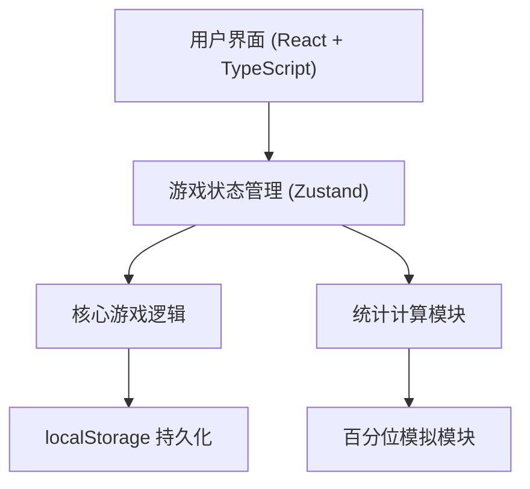
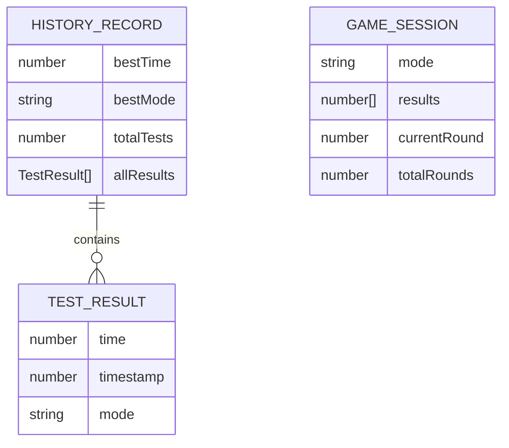

## 1. 架构设计

纯前端单页应用，无需后端服务。使用 localStorage 进行数据持久化。



## 2. 技术描述

- **前端**：React@18 + TypeScript + Vite
- **样式**：TailwindCSS@3
- **状态管理**：Zustand
- **图标**：lucide-react
- **数据存储**：localStorage（浏览器本地存储）
- **初始化工具**：vite-init

## 3. 目录结构

```
src/
├── components/
│   ├── GameArea.tsx        # 游戏主区域
│   ├── ModeSelector.tsx    # 模式选择器
│   ├── ResultDisplay.tsx   # 结果展示
│   ├── StatsCard.tsx       # 统计卡片
│   └── FeedbackPanel.tsx   # 训练反馈面板
├── hooks/
│   └── useReactionGame.ts  # 游戏核心逻辑 Hook
├── store/
│   └── useGameStore.ts     # Zustand 状态管理
├── utils/
│   ├── stats.ts            # 统计计算工具
│   └── percentile.ts       # 百分位模拟
├── types/
│   └── game.ts             # 类型定义
├── App.tsx
├── main.tsx
└── index.css
```

## 4. 核心类型定义

```typescript
// 游戏模式
type GameMode = 'simple' | 'continuous' | 'distraction';

// 游戏状态
type GameState = 'idle' | 'waiting' | 'ready' | 'result' | 'tooEarly';

// 单次测试结果
interface TestResult {
  time: number;           // 反应时间 (毫秒)
  timestamp: number;      // 测试时间戳
  mode: GameMode;         // 游戏模式
}

// 游戏会话
interface GameSession {
  mode: GameMode;
  results: number[];      // 当前会话的所有反应时间
  currentRound: number;   // 当前轮次
  totalRounds: number;    // 总轮次
}

// 统计数据
interface Stats {
  average: number;
  fastest: number;
  slowest: number;
  percentile: number;     // 击败百分比
}

// 历史记录
interface HistoryRecord {
  bestTime: number;
  bestMode: GameMode;
  totalTests: number;
  allResults: TestResult[];
}
```

## 5. 状态管理 (Zustand)

```typescript
interface GameStore {
  gameState: GameState;
  gameMode: GameMode;
  currentSession: GameSession | null;
  lastResult: number | null;
  history: HistoryRecord;
  distractionPhase: number;  // 干扰模式当前阶段
  
  setGameMode: (mode: GameMode) => void;
  startGame: () => void;
  handleClick: () => void;
  handleKeyPress: (key: string) => void;
  resetGame: () => void;
  loadHistory: () => void;
  saveHistory: () => void;
}
```

## 6. 核心逻辑说明

### 6.1 游戏流程控制
- **简单模式**：1 轮测试，显示结果后结束
- **连续模式**：5 轮测试，自动进入下一轮，最后显示统计
- **干扰模式**：屏幕闪烁 3-5 次后才变绿，增加难度

### 6.2 计时机制
- 使用 `performance.now()` 获得高精度时间戳
- 变绿瞬间记录开始时间
- 用户响应瞬间记录结束时间
- 差值即为反应时间

### 6.3 百分位模拟算法
基于正态分布模拟人群反应速度分布：
- 平均值：250ms
- 标准差：80ms
- 根据用户成绩计算在分布中的位置

### 6.4 localStorage 结构
```json
{
  "reactionGameHistory": {
    "bestTime": 185,
    "bestMode": "simple",
    "totalTests": 42,
    "allResults": [...]
  }
}
```

## 7. 数据模型

### 7.1 ER 图


